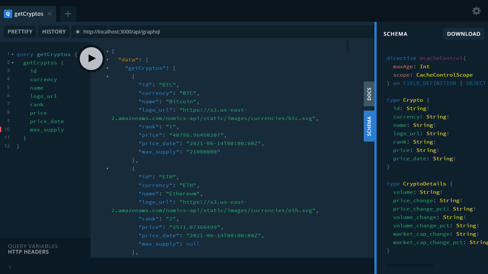

# :zap: Next API Data

* A Next.js React cryptocurrency api app using Apollo GraphQL client and Material-UI components.
* **Note:** to open web links in a new window use: _ctrl+click on link_


## :page_facing_up: Table of contents

* [:zap: Next API Data](#zap-next-api-data)
  * [:page_facing_up: Table of contents](#page_facing_up-table-of-contents)
  * [:books: General Info](#books-general-info)
  * [:camera: Screenshots](#camera-screenshots)
  * [:signal_strength: Technologies](#signal_strength-technologies)
  * [:floppy_disk: Setup](#floppy_disk-setup)
  * [:computer: Code Examples](#computer-code-examples)
  * [:clipboard: Status & To-Do List](#clipboard-status--to-do-list)
  * [:clap: Inspiration](#clap-inspiration)
  * [:file_folder: License](#file_folder-license)
  * [:envelope: Contact](#envelope-contact)

## :books: General Info

* Lists prices of cryptocurrencies.
* Next.js is for server-rendered react apps. It has automatic code splitting, simple page-based routing, built-in CSS support and hot reloading. Every component file in the pages folder is treated as a page

## :camera: Screenshots

.

## :signal_strength: Technologies

* [Node.js v14](https://nodejs.org/) javascript runtime using the [Chrome V8 engine](https://v8.dev/).
* [React v17](https://reactjs.org/) Javascript library.
* [GraphQL v15](https://github.com/graphql/graphql-js)
* [GraphQL Tag v2](https://www.npmjs.com/package/graphql-tag) utilities for parsing GraphQL queries
* [Apollo v2](https://www.apollographql.com/) GraphQL implementation data graph layer
* [Apollo Client v2](https://www.npmjs.com/package/apollo-client) fully-featured caching GraphQL client
* [Apollo Server Micro v2](https://www.npmjs.com/package/apollo-server-micro) Micro integration for the Apollo community GraphQL Server.
* [Next v10](https://nextjs.org/) minimalist framework for rendering react apps on the server.
* [Next with Apollo v5](https://www.npmjs.com/package/next-with-apollo)
* [Material-UI v4](https://www.npmjs.com/package/@material-ui/core) React components to save dev. time
* [Node module isomorphic-unfetch v3](https://www.npmjs.com/package/isomorphic-unfetch) for unfetch & node-fetch for client & server.
* [Node module Apollo Client v2](https://www.npmjs.com/package/apollo-client) caching GraphQL client to UI components can fetch data via GraphQL. More documentation [here](https://apollographql.com/docs/react/).
* [Node module apollo-cache-inmemory v1](https://www.npmjs.com/package/apollo-cache-inmemory) normalized data store that supports all of Apollo Client 1.0's features without the dependency on Redux.
* [Node module apollo-link-http](https://www.npmjs.com/package/apollo-link-http) to get GraphQL results over a network using HTTP fetch.
* [Intl.NumberFormat](https://developer.mozilla.org/en-US/docs/Web/JavaScript/Reference/Global_Objects/Intl/NumberFormat) language-sensitive number formatting.

## :floppy_disk: Setup

* `npm run dev` runs the app in the development mode. Open [http://localhost:3000](http://localhost:3000) to view it in the browser.
* `npm run build` builds the app for production to the `build` folder. It correctly bundles React in production mode and optimizes the build for the best performance. The build is minified and the filenames include the hashes.

## :computer: Code Examples

* extract of tba

```javascript
tba
```

## :clipboard: Status & To-Do List

* Status: Working
* To-Do: improve UI and add detail page.

## :clap: Inspiration

* [Next.js For Beginners - #4 - Exploring The Project Structure](https://www.youtube.com/watch?v=lNbOuGP1pag)

## :file_folder: License

* This project is licensed under the terms of the MIT license.

## :envelope: Contact

* Repo created by [ABateman](https://github.com/AndrewJBateman), email: gomezbateman@yahoo.com
